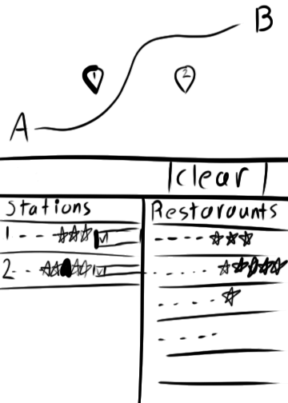
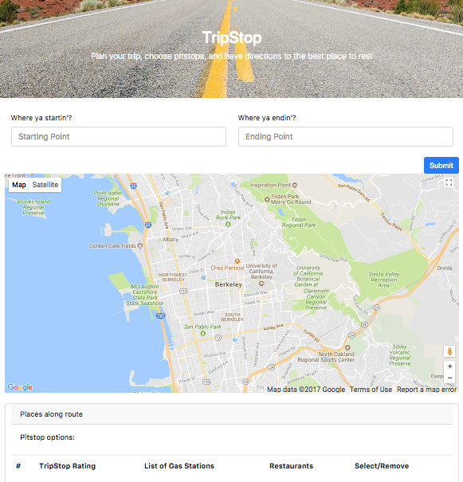

# TripStop

TripStop is a simple, easy to use App that helps you plan long road trips with up to date information on gas stations and restaurants.  Choose your favorite stops to receive an updated map and directions along with reviews of the gas-stations and restaurants.
To differentiate ourselves from roadtrippers, we can say we use google maps to not only target a wider audience that is familiar with it, but also state google’s data is more accurate than roadtrippers. Google maps ui/ux is much better as well. 
Using TripStop:
Input the start and end locations of your trip and hit submit. TripStop will return a map of your trip route.
You can touch anywhere on your route to search for local gas stations. They will be added to the list of searches under the map.
Each search area will give both the average rating of stations in that area, as well as a drop down list of each station found. Selecting a station from the list will show you nearby restaurants, which can be clicked for more information.
You can hit the blue check button to lock in your choice. If you do this, you will be given directions to that marker. If you click the red X button, you will remove the tab and the marker from the map. 

## Motivation 

Motivated by long and excruciating road trips, we have noticed the need for a simple app that gives a good idea about gas prices and the quality of local cuisine when traveling long distances. Too many times have we stopped only to regret paying over 5 dollars per gallon and having to resort to hot cheetos as lunch. 
For the long distance driver, TripStop provides a simple interface to evaluate gas stations and restaurants along their route, and get new directions to them. 

## Code 

Technologies: Google Maps Javascript API, Google Places Javascript API, jQuery,  jQuery UI, Firebase, Bootstrap, media queries, JavaScript, CSS, HTML.
## APIs

Google Maps API - The map API used
Google Place API - The businesses API used
Firebase - Users management
Bootstrap - Used to style the app
jQuery UI - Used for dynamic animations

### Screenshots

## Authors

Jorge Salas
John Alexander Ferguson
Nelson Chandra
Marshall Riddle
